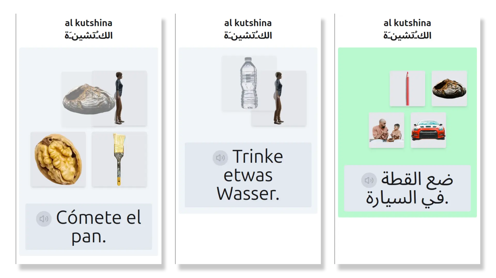

# Al Kutshina



A language learning game where users learn vocabulary by dragging items onto each other to perform actions. Players see visual cards and hear/read instructions like "Feed the cat" or "Put the bottle in the blue backpack", then drag the correct items together.

## Supported Languages

- English
- German
- Arabic
- Spanish

## Tech Stack

- **Framework**: Vue 3 with TypeScript
- **Routing**: Vue Router (hash history)
- **Styling**: Tailwind CSS + DaisyUI
- **Build**: Vite
- **Testing**: Vitest
- **Storage**: Firebase Firestore (cloud) + IndexedDB (local fallback)

## Getting Started

### Prerequisites

- Node.js
- Firebase project (for analytics - optional)

### Installation

```bash
npm install
```

### Development

```bash
npm run dev
```

### Build

```bash
npm run build
```

### Preview Production Build

```bash
npm run preview
```

### Run Tests

```bash
npm test
```

### Lint

```bash
npm run lint
npm run lint:fix  # auto-fix issues
```

## Project Structure

```
src/
├── components/
│   └── game/
│       ├── ExerciseRenderer.vue    # Main exercise controller
│       └── exercise/
│           ├── GridRenderer.vue    # Handles drag/drop grid
│           ├── FieldRenderer.vue   # Individual grid cells
│           ├── CardRenderer.vue    # Draggable item cards
│           ├── ItemRenderer.vue    # Item images
│           └── QuestDisplay.vue    # Instruction text/audio
├── views/
│   ├── Home.vue                    # Language selection
│   └── DirectPlay.vue              # Main game view
├── classes/
│   ├── GameHelper.ts               # Exercise generation logic
│   └── TranslationHelper.ts        # Translation lookups
├── composables/
│   ├── useFireStore.ts             # Firebase integration
│   ├── useIndexedDB.ts             # Local storage
│   └── useCellSize.ts              # Responsive grid sizing
├── data/
│   ├── items.json                  # Item definitions (~370 items)
│   └── translations.json           # Quest text in all languages
└── types/
    └── types.ts                    # TypeScript definitions
```

## Architecture

### Data Sources

1. **Items** (`src/data/items.json`) - Defines all game objects with:
   - `img`: Image filename
   - `key`: Semantic identifier (items with same key are variants)
   - `props`: Properties like color, size
   - `capabilities`: Actions this item can perform
   - `affordances`: Actions that can be performed on this item

2. **Translations** (`src/data/translations.json`) - Maps exercise keys to localized text. Keys follow the pattern `{item1}-{action}-{item2}` (e.g., `cat_food-feed-cat` → "Feed the cat").

3. **User Analytics** - Exercise results logged to Firebase/IndexedDB for learning analysis.

### Data Flow

```
User selects language (Home.vue)
           │
           ▼
DirectPlay.vue calls GameHelper.generateRandomExercise()
           │
           ▼
Algorithm selects two items with matching capability/affordance
           │
           ▼
Grid built with correct items + distractors
           │
           ▼
ExerciseRenderer displays grid + quest instruction
           │
           ▼
User drags card → GridRenderer checks interaction validity
           │
           ▼
If action matches quest → Success → Log result → Generate next exercise
```

### Exercise Generation

Exercises are generated algorithmically by `GameHelper.generateRandomExercise()`:

1. **Select two related items** - One item's capability must match another's affordance (e.g., knife can `cut`, apple can be `cut`)
2. **Generate distractors** - Wrong answers for the grid, selected to be challenging:
   - Same key, different property (red apple vs green apple)
   - Same property, different key (any red item)
3. **Build quest string** - Format: `{sender_key}-{action}-{receiver_key}`
4. **Look up translation** - Find localized text and audio

### Interaction System

Items define what they can do and what can be done to them:

```json
{
  "img": "knife",
  "key": "knife",
  "capabilities": [["cut", 0]],
  "affordances": []
}
```

```json
{
  "img": "apple_red",
  "key": "apple",
  "props": {"color": "red"},
  "capabilities": [],
  "affordances": [["cut", 2, "apple_half"]]
}
```

When a user drags the knife onto the apple:
1. System finds matching action (`cut`)
2. Knife disappears (reaction type 0)
3. Apple transforms to `apple_half` (reaction type 2 = ChangeTo)

**Reaction Types**:
- `0` - Disappear
- `1` - Return (stay visible)
- `2` - Change to another item
- `3` - Add overlay image

### Progression

There are no predefined levels. The system uses infinite procedural generation:

- **Tutorial**: First exercise is hardcoded (feed a cat) to teach the mechanic
- **After tutorial**: Random exercises generated indefinitely
- **Implicit difficulty**: Varies by number of distractors and whether properties are involved in the quest

## Component Hierarchy

```
DirectPlay.vue (manages current exercise state)
└── ExerciseRenderer.vue (tracks success/failure, logs results)
    ├── GridRenderer.vue (handles drag/drop interactions)
    │   └── FieldRenderer.vue (grid cells)
    │       └── CardRenderer.vue (draggable items)
    │           ├── ItemRenderer.vue (item images)
    │           └── ExtraImageRenderer.vue (overlays)
    └── QuestDisplay.vue (instruction text + audio playback)
```

## Testing

Tests are written with Vitest and located in `src/tests/`. Currently covers:

- **GameHelper distractor logic** - Tests the algorithm that selects challenging wrong answers based on item properties (e.g., showing a red car when the quest asks for a yellow car)
